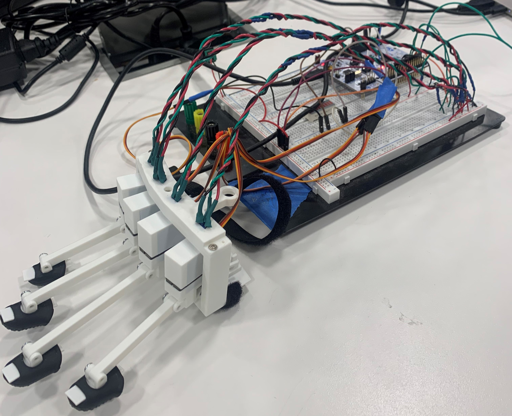
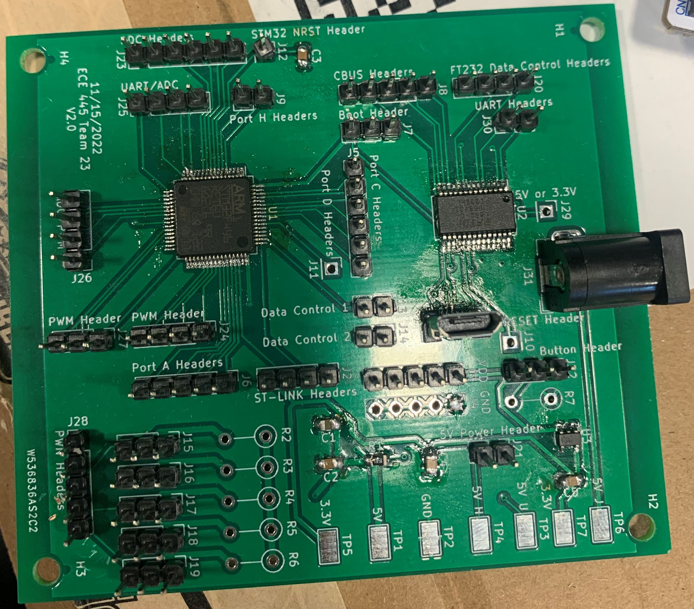

# ECE 445 Fall 2022 - Team 23

**Team Members**
- Yoonseo Choi (yschoi4)
- Aaron Gros (aygros2)
- Sean Kim (sk5)

**Lateral Movement Force-Feedback VR Gloves**

We have created a low-cost and open source force-feedback VR glove for lateral finger movement. It is able to acurate track and restrict the index, middle, ring, and pinky finger.

**Google Drive Repository** 
[Google Repo Link](https://drive.google.com/drive/folders/11H3rUvDkAtsJpdgwuR88esnsnRXGqsm2?usp=sharing)

