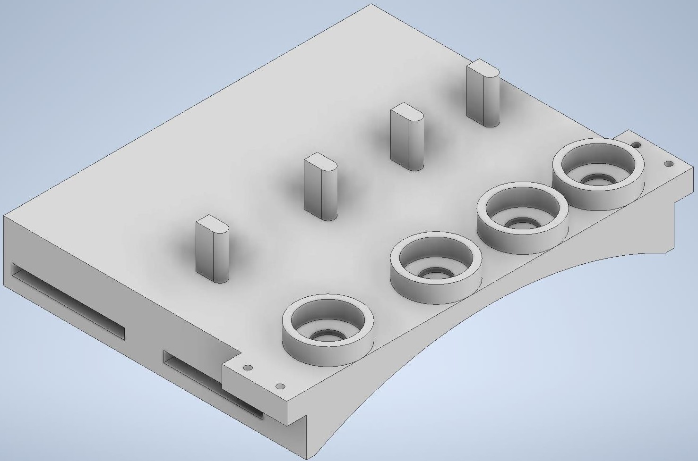
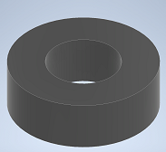
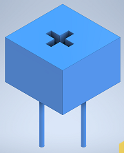
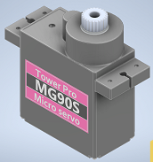
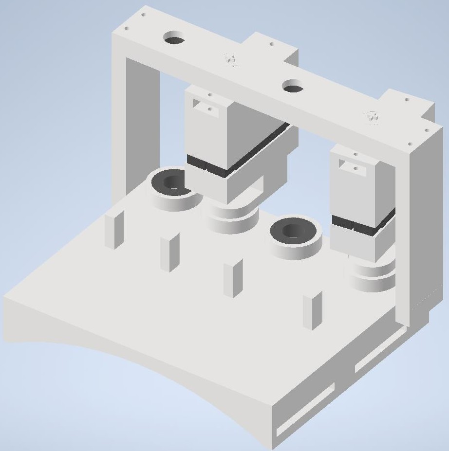
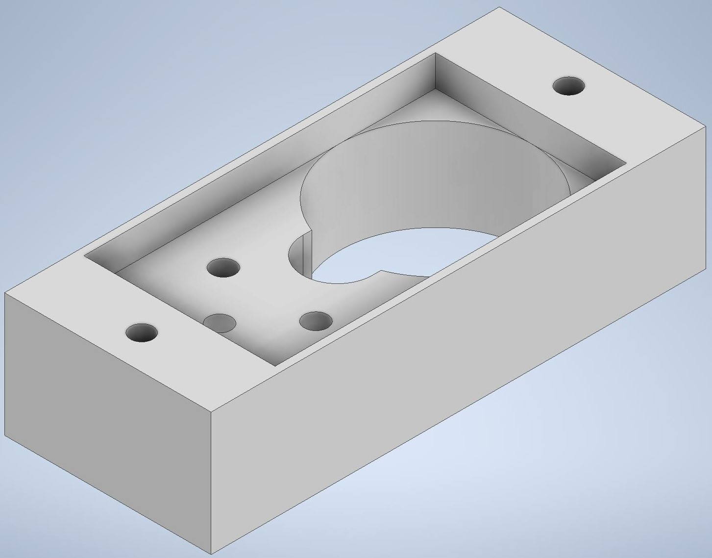
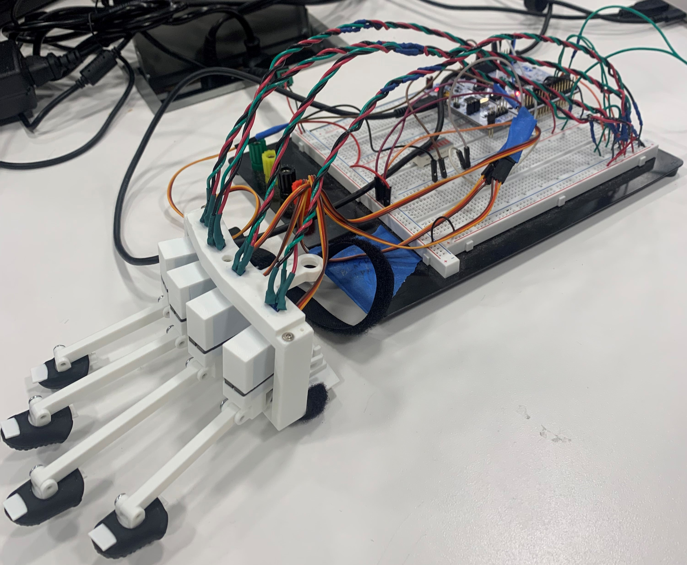

10/17/2022

**Objective:** Get started 3d modeling all the pieces

**Accomplished:** Designed a base that stays in place on one’s hand with velcro straps. It also had bearing holders and stopping pins. I got a 3d model of the servo we’re using online. I made a model for our bearing and potentiometer based on dimensions I found where I ordered them. I made two pieces that go on the top and bottom of the servo and attach to bearings. I designed a piece with bearing holders that attaches to the base and holds the servo in place. I designed a piece that goes over the previous piece and holds the potentiometers. I made an extension to the servo arm that interacts with the stopping pin.

---

10/24/2022

**Objective:** Separate the previous 3d models into pieces that have as few overhangs as possible to simplify the printing process in case the previous models can’t be printed. Make an assembly of all the pieces.

**Accomplished:** I separated the pieces as best I could to avoid overhangs, and I made an assembly of most of the pieces.

---

11/4/2022

**Objective:** Print all the pieces

**Accomplished:** I finally got the 3d printing filament and access to a 3d printer so I was able to print all the pieces to test them. The base feels uncomfortable and probably needs to be redesigned but the rest seem pretty good.

---

11/7/2022

**Objective:** model base and affected parts after an image on my hand to make it fit better. Modify servo arm to only require one screw. Find out the right size for bearing holders and inserts, as well as screw holes.

**Accomplished:** redesigned the base, potentiometer holder, and servo holder to follow the shape of my hand since the last design felt pretty uncomfortable and didn’t alight very well with the joints. I also added guard rails on the servo arm so that I can only use one screw without having the servo arm slider around. Lastly, I tested several pieces to find the right size for the bearing holders and inserts, and to find the right size of screw holes.

---

11/8/2022

**Objective:** Find some guides on how to get started

**Accomplished:** Found a guide to rotate an object: https://www.youtube.com/watch?v=NXbJPScS5fI. 
And a guide to setup serial communication: https://www.youtube.com/watch?v=ElM9EQVjR-8 

---

11/10/2022

**Objective:** To implement serial communication following this guide: https://www.youtube.com/watch?v=ElM9EQVjR-8 

**Accomplished:** I got serial communication to work and it reads serial when I press space. However, I need to add a way to parse the data to extract just what I need. Here’s an image of the current unreal engine blueprint

---

11/12/2022

**Objective:** To add a way to switch ports while the program is running, and to parse the data to be able to extract the potentiometer values.

**Accomplished:** I added port switching by ‘w’ or ‘s’ to go up or down a port, respectively. I also got the data parsing to work. I ended up having to set up a buffer that I add the serial data to since every iteration I only read part of the serial message. I also added delimiters to know where the beginning and end of the packet is, and added ‘,’ in between each potentiometer value to be able to parse those. Below is the updated unreal engine blueprint.

---

11/13/2022

**Objective:** Want to make an object in unreal engine that can be rotated and that stops rotating when it collides with an object.

**Accomplished:** Made a rectangle that I could rotate left or right by pressing ‘g’ or ‘h’, respectively. I haven’t been able to get it to sense collision so it just goes inside other objects. I’m not sure if it’s because I’m using a static mesh and maybe I should be using a skeletal mesh. Below I show how the rectangle ends up overlapping the other rectangle.

---

11/15/2022

**Objective:** Increase the servo arm degrees of freedom. Add extra space between the pinky and ring fingers. Add extra space between bearing holder and servo holder legs. Add a way to attack the bottom servo mount to the fingertip.

**Accomplished:** modified the base, potentiometer holder, and servo holder to add extra space on the side of some of the bearing holders. Gave the stopping pins offset heights to offset the orientation of the servo arm allowing for more degrees of freedom without hitting each other. Also widened the servo arm to achieve this. The stopping pins end up bending under load, and the finger exoskeleton isn’t the right length. 

---

11/17/2022

**Objective:** Figure of how to get static meshes to sense collisions or switch to a skeletal mesh. Get the mesh to stop rotating when it collides.

**Accomplished:** I got the static mesh to sense collisions and stop rotating when it hits another object. The issue was that I had the wrong collision preset selected on both the objects. Below I show the mesh stopping when it collides.

---

11/20/2022

**Objective:** add removable potentiometer key to servo top mount, fix finger tip, add button mount, find right finger exoskeleton length, and adjust base stopping pin offset heights.

**Accomplished:** Printed several test pieces to find the right size for the removable potentiometer key and its hole. Made a less flimsy finger tip piece. Found the right length for each finger exoskeleton piece. Added a latching button mount to the potentiometer holder. Adjusted the offset heights of the stopping pin on the base and added a piece connecting the bearing and stopping to prevent the stopping pin from bending.

---

11/22/2022

**Objective:** Make a two mesh that can rotate together but have independent left and right collisions. Add the serial communication from before to control the rotation angle.

**Accomplished:** I made a left and right hand finger model in blender and imported them into unreal engine. I was able to make the both meshes part of the same object by adding both of them to a blueprint class. They are able to rotate together and sense collisions on their corresponding side. Getting the meshes to rotate took longer than I expected because the angels became negative so I had to do some math on the angle before using it. I also got the serial data to control the rotation and added serial output notifying of collisions. Below is the finger mesh in unreal engine next to a box it collides with, there also an image of the blueprint for the finger blueprint class

---

11/23/2022

**Objective:** To take the individual working finger and copy it to create a hand without the thumb.

**Accomplished:** Made the hand without the thumb, the collisions on each finger are working correctly, and they are all controlled with the serial data.

---

11/27/2022

**Objective:** Integrate the firmware with the virtual simulation

**Accomplished:** Adjusted some issues in the serial data parsing. Calibrated the firmware based on the physical glove, and calibrated the virtual simulation based on the firmware. Got the entire project to work together on the dev board. Had to angle the potentiometer to avoid an area of the potentiometer that wasn’t working. Below is the physical glove connected with the dev board which is connected to the computer, and an image of the angled potentiometer key.

---

12/08/2022

Worked on the presentation, and final report this week.
